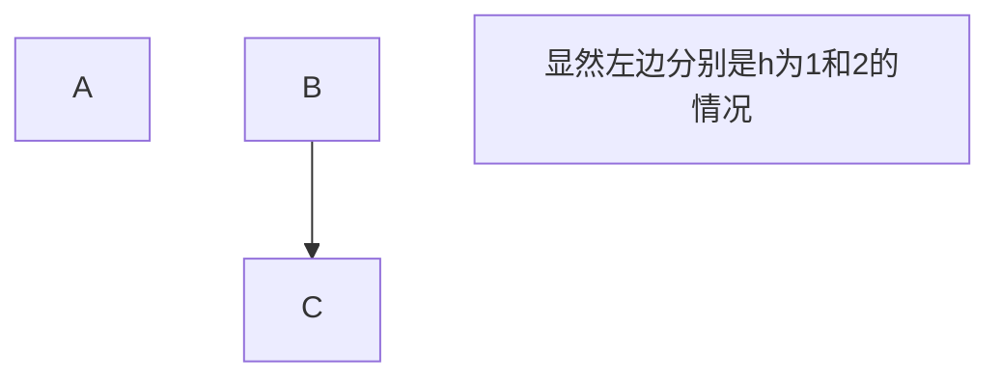

# 查找大法

## 1、顺序查找与二分法查找

---
## 2、顺序二叉树与平衡二叉树

### 顺序二叉树

- 题目：下列哪个序列不是顺序二叉树的搜索序列

  > 如：$$a_1, a_2, a_3, a_4,a_5,a_6$$
  >
  > 如何判断：对于$$a_i$$来说，如果$$a_{i+1}>a_i$$，那么，所有$$n>i都有a_n>a_i$$。

### 平衡二叉树

- 平衡因子：**左**子树的高度**减**去**右**子树的高度，$$h_左-h_右$$
- 分支节点：度不为0的节点

- 平衡二叉树的**旋转**

  > - 对节点`A`左旋：
  >
  >   > 1、`A` **右**孩子的**左**孩子变成`A`的**右**孩子：`A->right = A->right->left`
  >   >
  >   > 2、`A`的**右**孩子取代`A`的位置
  >   >
  >   > 3、`A`变成**右**孩子的**左**孩子：`A->right->left = A`
  >
  > - 对节点`A`右旋：
  >
  >   > 1、`A` 左孩子的右孩子变成`A`的左孩子：`A->left = A->left->right`
  >   >
  >   > 2、`A`的左孩子取代A的位置
  >   >
  >   > 3、`A`变成左孩子的右孩子：`A->left->right = A`

- 平衡二叉树的**插入**（王道书  $$P_{274}$$）

  > - 基本假设：找到**插入路径**上离**插入点**最近的**不平衡**节点`A`，`A`一般是插入树`C`的**爷爷**，设`B`是`C`的**父亲**
  >
  >   > 第一是找**不平衡节点**
  >   >
  >   > 第二是`C`可能是新节点也可能不是，是在`C`的**子树**或者`C`处插入，但是`C`没有失衡
  >   >
  >   > 第三是`B`必须是**插入路径**上的节点，插入路径和排序二叉树一样的
  >
  > - 核心思想：将中间大小的节点旋转到`A`的位置，这里很混乱，没关系，看下面的
  >
  > - 1、`LL`平衡旋转：`A`的**左（L）**孩子是`B`，`B`的**左（L）**孩子是`C`
  >
  >   > 1）**右**单旋转即可
  >   >
  >   > 2）对`A`点右旋一次即可
  >   >
  >   > 3）核心思想：显然有`A>B>C`，最后右旋一下，`B（中间大小）`取代了`A`
  >
  > - 2、`RR`平衡旋转：`A`的**右（R）**孩子是`B`，`B`的**右（R）**孩子是`C`
  >
  >   > 1）左单旋转即可
  >   >
  >   > 2）对`A`点左旋一次即可
  >   >
  >   > 3）核心思想：显然有`A<B<C`，最后右旋一下，`B（中间大小）`取代了`A`
  >
  > - 3、`LR`平衡旋转：`A`的**左（L）**孩子是`B`，`B`的**右（R）**孩子是`C`
  >
  >   > 1）先左后右旋转
  >   >
  >   > 2）先对`B`**左**旋，后对`A`**右**旋
  >   >
  >   > 3）核心思想：显然是`B<C<A`，最后是把`C`旋转到`A`的位置
  >   >
  >   > 4）解释：
  >   >
  >   > - 对`B`左旋：将`C`提升到`B`的位置，提升第一次，`C`变成儿子，`B`变成孙子
  >   > - 对`A`右旋：将`C`提升到`A`的位置，提升第二次，`C`变成爷爷，`A`变成儿子
  >
  > - 4、`RL`平衡旋转：`A`的**右（R）**孩子是`B`，`B`的**左（L）**孩子是`C`
  >
  >   > 1）先右后左旋转
  >   >
  >   > 2）先对`B`**右**旋，后对`A`**左**旋
  >   >
  >   > 3）核心思想：显然是`B>C>A`，最后是把`C`旋转到`A`的位置
  >   >
  >   > 4）解释：
  >   >
  >   > - 对`B`右旋：将`C`提升到`B`的位置，提升第一次，`C`变成儿子，`B`变成孙子
  >   > - 对`A`左旋：将`C`提升到`A`的位置，提升第二次，`C`变成爷爷，`A`变成儿子

- 平衡二叉树的**删除**

  > - 基本假设：`w`是需要**删除**的节点，从`w`向上面找，离`w`**最近且失衡**的节点为`z`
  >
  >   > `z`有左右子树，左右子树高度差大于1，设高度较**高**的**子树根节点**为`y`
  >   >
  >   > `y`有左右子树，左右子树高度差小于等于1，设高度较**高**的**子树根节点**为`x`
  >   >
  >   > 如果`y`的左右子树高度相等，那么`x`任意左还是右
  >   >
  >   > 还是有，`z`是爷爷，`y`是父亲，`x`是孙子
  >
  > - 核心思想：还是把中间大小的节点旋转到`z`处
  >
  > - 1、`LL`平衡旋转：`z`的**左（L）**孩子是`y`，`y`的**左（L）**孩子是`x`
  >
  >   > 1）**右**单旋转即可
  >   >
  >   > 2）对`z`点右旋一次即可
  >   >
  >   > 3）核心思想：显然有`z>y>x`，最后右旋一下，`y（中间大小）`取代了`z`
  >
  > - 2、`RR`平衡旋转：`z`的**右（R）**孩子是`y`，`y`的**右（R）**孩子是`x`
  >
  >   > 1）左单旋转即可
  >   >
  >   > 2）对`z`点左旋一次即可
  >   >
  >   > 3）核心思想：显然有`z<y<x`，最后右旋一下，`y（中间大小）`取代了`z`
  >
  > - 3、`LR`平衡旋转：`z`的**左（L）**孩子是`y`，`y`的**右（R）**孩子是`x`
  >
  >   > 1）先左后右旋转
  >   >
  >   > 2）先对`y`**左**旋，后对`z`**右**旋
  >   >
  >   > 3）核心思想：显然是`y<x<z`，最后是把`x`旋转到`z`的位置
  >   
  > - 4、`RL`平衡旋转：`z`的**右（R）**孩子是`y`，`y`的**左（L）**孩子是`x`
  >
  >   > 1）先右后左旋转
  >   >
  >   > 2）先对`y`**右**旋，后对`z`**左**旋
  >   >
  >   > 3）核心思想：显然是`y>x>z`，最后是把`x`旋转到`z`的位置
  >

- 树高为`h`时，节点数`n`的最小值怎么计算

  > 1、先给出答案：$$n(h)_{min} = n(h-1)_{min} + n(h-2)_{min} + 1$$
  >
  > ​			且 $$n(0)_{min} = 0;n(1)_{min} = 1 ; n(2)_{min} = 2;$$ 这个应该很好得知，就像下面图示一样，
  >
  > 2、证明吧：首先，设定$n(x)_{min}$为树高为$x$时，最少需要的节点数目
  >
  > 3、假设现在有两棵$AVL$，且$AVL_1$的树高为`h-1`，$AVL_2$的树高为`h-2`
  >
  > 4、树高为`h`的`AVL`，左右子树也是一颗`AVL`，且左右子树的树高差不超过`1`
  >
  > 5、也就是说，左右子树的树高要么都为`h-1`（方法1）；
  >
  > ​						要么一个为`h-1`，一个为`h-2`（方法2）。
  >
  > 6、既然想要追求节点少，那么肯定是树高最小最好，肯定选择方法2。
  >
  > ​		不妨设左子树为`h-1`，右子树为`h-2`
  >
  > 7、那就可以用上述的$AVL_1 和 AVL_2$来作为`AVL`的两棵子树，再加上一个新的根节点
  >
  > 8、那么节点数目递推公式就是：$$n(h)_{min} = n(h-1)_{min} + n(h-2)_{min} + 1$$

  $$
  \begin{cases}
  n(h)_{min} & 高度为 h 的最小节点数目\\
  n(h-1)_{min} & 高度为 h-1 左子树的最小节点数目\\
  n(h-2)_{min} & 高度为 h-2 右子树的最小节点数目\\
  1 & 额外的根节点数目
  \end{cases}
  $$

---
## 3、重头戏——红黑树

